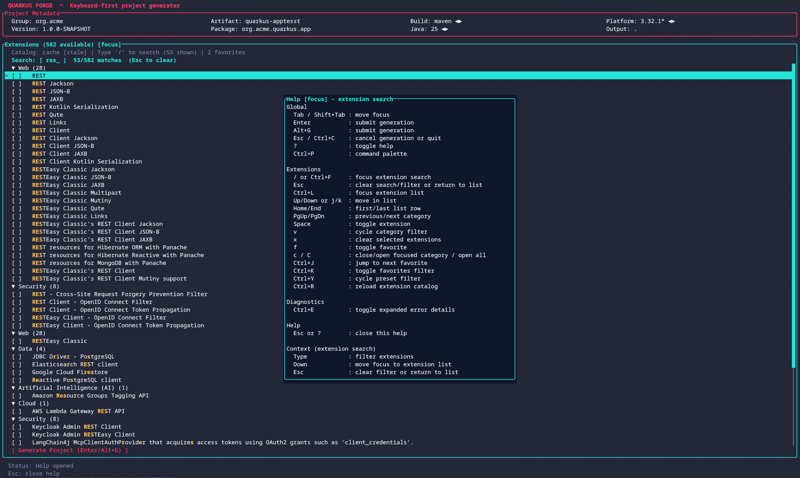

# Quarkus Forge

[](https://github.com/ayagmar/quarkus-forge/actions/workflows/ci.yml)
[](https://github.com/ayagmar/quarkus-forge/releases/latest)
[](https://codecov.io/gh/ayagmar/quarkus-forge)
[](https://openjdk.org/projects/jdk/25/)
[](https://www.jbang.dev/)

> **[Documentation & Landing Page](https://ayagmar.github.io/quarkus-forge/)** · **[Getting Started](https://ayagmar.github.io/quarkus-forge/docs/getting-started/)**

Quarkus Forge is a keyboard-first terminal UI (TUI) and headless CLI for generating and scaffolding Quarkus projects. It acts as a fast, offline-capable alternative to `quarkus create`, deeply integrated with `code.quarkus.io`'s remote metadata but built for terminal power users.



## Why use Quarkus Forge?

- **Keyboard-First TUI:** Zero-mouse, Vim-like bindings for navigating catalogs, toggling extensions, and validating inputs. Fuzzy search highlighting, chip-style selected extensions, selector arrows with position hints, and animated progress feedback.
- **Speed & Caching:** Background loading and local snapshot caching mean you don't wait for the network to start configuring your project.
- **Headless & CI-Ready:** Powerful non-interactive modes for generating applications identically across local environments and CI pipelines.
- **Deterministic State:** Supports `Forgefile` with an optional `locked` section for exact reproduction of generated applications, much like standard dependency managers.
- **Customizable:** Theming via `.tcss` files, IDE auto-detection with `QUARKUS_FORGE_IDE_COMMAND` override, post-generation hooks.
- **Workflow Enhancers:** Post-generation handoffs let you open in your auto-detected IDE, drop into a shell, or publish to GitHub — all from the keyboard.

## Quarkus Forge vs `quarkus create`

| Feature | Quarkus Forge | `quarkus create` |
|---------|--------------|-------------------|
| **Offline / no-internet** | ✅ snapshot cache fallback | ❌ requires network |
| **Keyboard-first TUI** | ✅ full Vim-style navigation | ❌ wizard prompts |
| **Deterministic replay** | ✅ Forgefile + `--lock` | ❌ |
| **CI headless jar** | ✅ no TUI deps (~40% smaller) | ⚠️ includes full CLI toolchain |
| **Fuzzy extension search** | ✅ | ❌ |
| **Session persistence** | ✅ remembers last config | ❌ |
| **Theming** | ✅ `.tcss` override | ❌ |
| **Post-gen IDE open** | ✅ auto-detects IDEs | ❌ |
| **Quarkus CLI required** | ❌ plain JRE / JBang | ✅ |

## TUI vs Headless

| | TUI (interactive) | Headless (`generate`) |
|--|--|--|
| **Best for** | Local development, exploration | CI pipelines, scripting, containers |
| **Jar** | `quarkus-forge.jar` | `quarkus-forge-headless.jar` |
| **Interaction** | Keyboard-driven UI | Flags only, non-interactive |
| **Extension search** | Live fuzzy search | `--extension` / `--preset` flags |
| **Forgefile** | Export via post-gen menu | `--from`, `--save-as`, `--lock` |
| **Post-gen hooks** | IDE open, GitHub, shell handoff | n/a |
| **JVM flag needed** | `--enable-native-access=ALL-UNNAMED` | none |

## Keyboard Quick Reference (TUI)

| Key | Action |
|-----|--------|
| `?` | Help overlay |
| `Ctrl+P` | Command palette |
| `/` or `Ctrl+F` | Focus extension search |
| `Space` | Toggle extension |
| `Enter` / `Alt+G` | Generate project |
| `Ctrl+R` | Reload catalog |
| `Ctrl+K` | Toggle favorites-only |
| `v` | Cycle category filter |
| `c` | Toggle current category |
| `C` | Open all categories |
| `x` | Clear selected extensions |
| `Esc` | Unwind filter context / exit |
| `Ctrl+C` | Quit immediately |

Full keybindings: [docs/modules/ROOT/pages/ui/keybindings.adoc](docs/modules/ROOT/pages/ui/keybindings.adoc)

## Requirements

- Java 25+
- Maven 3.9+

## Build

### Full build (TUI + headless)
```bash
mvn clean package -DskipTests
```

Output: `target/quarkus-forge.jar`

### Headless-only build
```bash
mvn clean package -Pheadless
```

Output: `target/quarkus-forge-headless.jar` — ~40% smaller, no TUI or terminal dependencies.

### Native image build
```bash
mvn clean package -Pnative
```

Output: `target/quarkus-forge-native` — standalone binary, no JVM required at runtime.

> **Note:** Native image requires GraalVM or a compatible toolchain. Set `GRAALVM_HOME` before building.

## Quick Start

### JBang (no build required)

Run directly from the JBang catalog:
```bash
jbang quarkus-forge@ayagmar
```

Headless-only (no TUI dependencies, ideal for CI):
```bash
jbang quarkus-forge-headless@ayagmar generate \
  --group-id org.acme \
  --artifact-id demo \
  --build-tool maven \
  --java-version 25
```

Install as a persistent local command:
```bash
jbang app install --name quarkus-forge quarkus-forge@ayagmar
quarkus-forge
```

### Interactive TUI
```bash
java --enable-native-access=ALL-UNNAMED -jar target/quarkus-forge.jar
```
> **Note:** The `--enable-native-access=ALL-UNNAMED` flag suppresses Panama FFM warnings from the TamboUI terminal backend.

Hit `?` for help, `Ctrl+P` for the command palette, or `/` to jump to extension search.

### Headless Generate
```bash
java -jar target/quarkus-forge-headless.jar generate \
  --group-id org.acme \
  --artifact-id demo \
  --build-tool maven \
  --java-version 25
```

> The full jar (`quarkus-forge.jar`) also supports the `generate` subcommand. The headless-only jar is preferred for CI/containers — no TUI or terminal dependencies.

### Dry-Run
```bash
java -jar target/quarkus-forge-headless.jar generate --dry-run \
  --group-id org.acme \
  --artifact-id demo
```

### Post-Generation Hooks
```bash
java -jar target/quarkus-forge.jar \
  --post-generate-hook="git init && git add . && git commit -m 'Initial commit'"
```

### Deterministic Replay
```bash
# Generate from a Forgefile template
java -jar target/quarkus-forge-headless.jar generate --from Forgefile

# Generate and write/update the locked section
java -jar target/quarkus-forge-headless.jar generate --from Forgefile --lock

# Verify no drift against locked section
java -jar target/quarkus-forge-headless.jar generate --from Forgefile --lock-check --dry-run

# Save current configuration as a shareable template
java -jar target/quarkus-forge-headless.jar generate --save-as my-template.json --lock \
  --group-id com.acme --artifact-id my-service -e io.quarkus:quarkus-rest
```

## Customization

### Theming
Create a `.tcss` file with semantic color tokens (one `token = value` per line):
```
base = #1e1e2e
text = #cdd6f4
accent = #f38ba8
focus = #89b4fa
muted = #6c7086
```
Apply via environment variable or system property:
```bash
export QUARKUS_FORGE_THEME=/path/to/my-theme.tcss
# or
java -Dquarkus.forge.theme=/path/to/my-theme.tcss -jar target/quarkus-forge.jar
```

### IDE Auto-Detection
After generating a project, Quarkus Forge auto-detects installed IDEs (IntelliJ IDEA, VS Code, Eclipse, Cursor, Zed, Neovim) and shows one menu entry per detected IDE.

To override auto-detection, set `QUARKUS_FORGE_IDE_COMMAND`:
```bash
export QUARKUS_FORGE_IDE_COMMAND="idea ."        # Force IntelliJ
export QUARKUS_FORGE_IDE_COMMAND="code-insiders ."  # VS Code Insiders
```

## Where Files Live

- **Machine-local app state:** `~/.quarkus-forge/`
  - `catalog-snapshot.json` — catalog cache/snapshot (offline fallback)
  - `preferences.json` — user preferences (restored on next launch)
  - `favorites.json` — favorite extensions
  - `recipes/` — reusable Forge recipes
- **Project/workflow files:**
  - `Forgefile` — shareable project template with optional `locked` section for CI reproducibility

Forgefile path resolution:
- `--from <name>`: uses local file if found; otherwise resolves `~/.quarkus-forge/recipes/<name>`.
- `--save-as <name>`: writes to `~/.quarkus-forge/recipes/<name>` when `<name>` is just a filename.

## Architecture

The codebase is organized into focused modules that follow SOLID principles and separate concerns cleanly.

### API Layer (`api/`)
- **`QuarkusApiClient`** — Async HTTP client with retry/backoff, implements `AutoCloseable` for resource safety. Responsible only for transport orchestration.
- **`ApiPayloadParser`** — Stateless JSON deserialization for all API payloads (extensions, metadata, streams, presets, OpenAPI).
- **`JsonFieldReader`** — Shared JSON field reading helpers used across all store and parser classes (DRY).
- **`CatalogSnapshotCache`** — Local catalog snapshot persistence and freshness management.

### Domain Layer (`domain/`)
- **`ProjectRequest`** / **`ProjectRequestValidator`** — Immutable project configuration with validation rules.
- **`MetadataCompatibilityContext`** — Enforces metadata-driven compatibility constraints (build tool ↔ Java version).
- **`CliPrefillMapper`** — Maps CLI options to validated project requests.

### UI Layer (`ui/`)
- **`CoreTuiController`** — Central TUI state machine managing focus, input, and generation flow.
- **`OverlayRenderer`** — Stateless overlay rendering (command palette, help, progress, post-generation menus).
- **`MetadataSelectorManager`** — Metadata selector state (platform stream, build tool, Java version cycling and label generation).
- **`UiTextConstants`** — UI text content (help lines, splash art, action labels).
- **`ExtensionCatalogState`** — Extension catalog search, filtering, favorites, presets, and category navigation.
- **`BodyPanelRenderer`** / **`FooterLinesComposer`** — Layout rendering helpers.

### CLI Layer (root package)
- **`QuarkusForgeCli`** — Picocli command entry point for TUI mode, runtime configuration, and startup metadata resolution.
- **`HeadlessCli`** — Lightweight entry point for headless/CI mode (no TUI or terminal dependencies).
- **`HeadlessGenerationService`** — Decoupled headless generation engine for CI/scripting, with `AsyncFailureHandler` for consistent error handling.
- **`ExitCodes`** — Central exit code constants shared by both entry points.
- **`PostTuiActionExecutor`** — Post-generation shell actions (IDE open, GitHub publish, terminal handoff).
- **`IdeDetector`** — Cross-platform IDE auto-detection (macOS, Linux, Windows).
- **`ForgefileStore`** — Forgefile persistence (with optional locked section).

### Archive Layer (`archive/`)
- **`SafeZipExtractor`** — Hardened ZIP extraction with Zip-Bomb and Zip-Slip protections.
- **`ProjectArchiveService`** — Orchestrates download, extraction, and progress reporting.

For a complete overview of the internal design, see the [Architecture & Internals](docs/modules/ROOT/pages/architecture.adoc) documentation.

## Docs

Full documentation is available at **[ayagmar.github.io/quarkus-forge](https://ayagmar.github.io/quarkus-forge/docs/)**.

Source pages (AsciiDoc):

- [Getting Started](docs/modules/ROOT/pages/getting-started.adoc)
- [TUI Usage](docs/modules/ROOT/pages/usage/tui.adoc)
- [Keybindings](docs/modules/ROOT/pages/ui/keybindings.adoc)
- [Headless CLI](docs/modules/ROOT/pages/cli/headless-mode.adoc)
- [Forge Files & State](docs/modules/ROOT/pages/reference/forge-files-and-state.adoc)
- [Theming](docs/modules/ROOT/pages/ui/theming.adoc)
- [Architecture](docs/modules/ROOT/pages/architecture.adoc)
- [Troubleshooting](docs/modules/ROOT/pages/troubleshooting.adoc)

Antora docs source: `docs/` · Site build scripts: `site/` · Local site guide: `site/README.md`

## Contributing

```bash
sdk env install          # install Java 25 via SDKMAN! (.sdkmanrc)
just verify              # format-check + headless compile + all tests
just format              # auto-format
```

Or without `just`: `./mvnw clean verify` and `./mvnw spotless:apply`.

Coverage reports: `target/site/jacoco/index.html` (unit) and `target/site/jacoco-it/index.html` (integration).

See [CONTRIBUTING.md](CONTRIBUTING.md) for full setup guide, code style, testing conventions, and commit format. PRs welcome.
